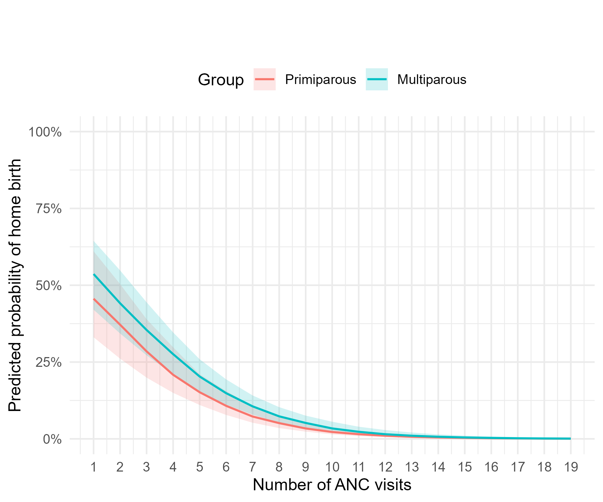

# Homebirth Outcomes in SMRU Clinics

This repository contains the public dataset and analysis code used to generate the results and Figure 1 reported in the manuscript examining predictors of home birth among women receiving antenatal care in SMRU clinics.

---

## Figure 1

Predicted probability of home birth by number of antenatal care (ANC) visits, stratified by parity.



---


# Repository Structure

```
SMRU_homebirth/
├── data/
│   └── homebirth_analysis.csv
│
├── scripts/
│   └── analysis_main.R
│
├── docs/
│
├── output/
│   ├── tables/
│   └── figures/
│
└── README.md
```

---

# Scripts and Workflow

### scripts/analysis_main.R

Primary analysis pipeline.

This script:

1. Loads the public dataset  
2. Constructs the analysis dataset  
3. Fits a mixed-effects logistic regression model with a random intercept for clinic (`OR_site`)  
4. Calculates clustering statistics (variance, MOR, ICC)  
5. Generates the main results table (descriptive statistics, UOR, AOR)  
6. Produces predicted probability curves for home birth by number of ANC visits (Figure 1)
7. Saves Figure 1 to the `output/figures/` directory

Running the script will automatically create output folders if they do not exist.

---

# Data

`data/homebirth_analysis.csv`

Public analysis dataset containing pseudonymized participant-level observations.

Key identifiers:

- `ANC_code` – participant identifier
- `OR_site` – clinic identifier

The dataset contains one row per participant.

---

# Requirements

The analysis was conducted in **R** using the following packages:

- lme4
- boot
- ggplot2
- scales
- mvtnorm

Install packages if needed:

```r
install.packages(c("lme4","boot","ggplot2","scales","mvtnorm"))
```

---

# Running the analysis

From the project root:

```r
source("scripts/analysis_main.R")
```

---

# Citation

If using this repository or dataset, please cite the associated manuscript.
